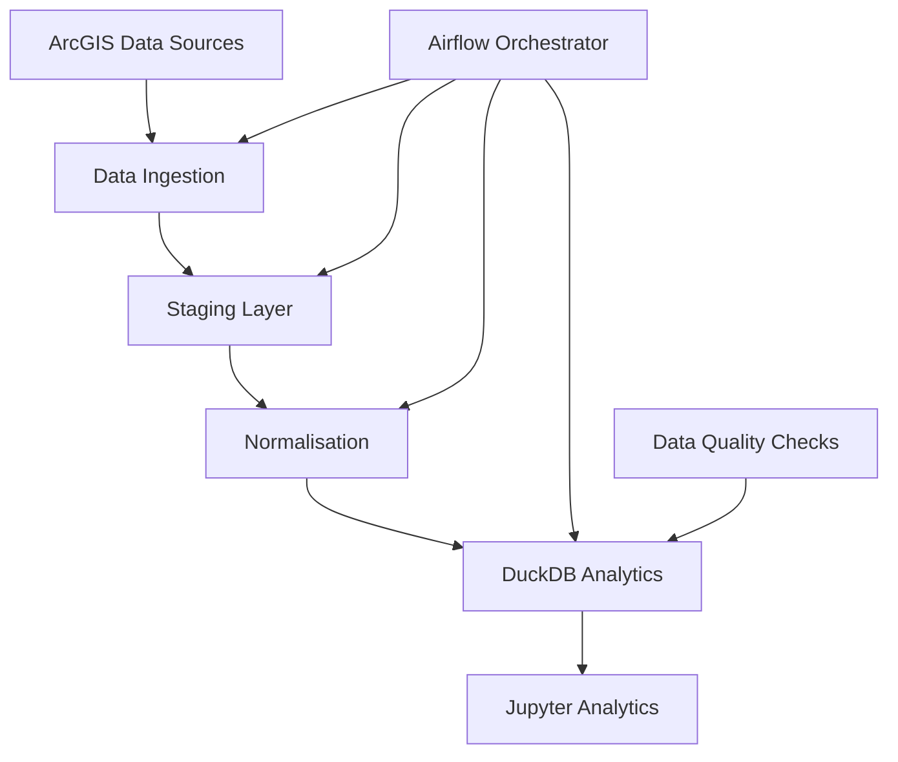
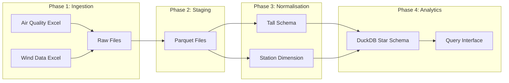
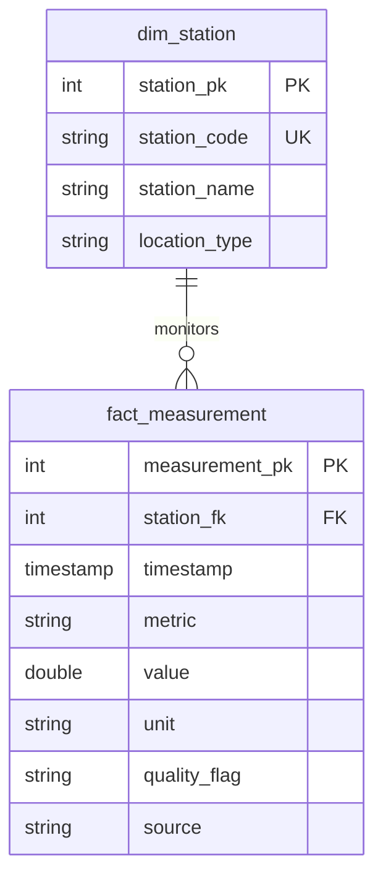

# CCT Environmental Sensors Pipeline

A batch data processing pipeline for City of Cape Town environmental sensor data. Transforms raw ArcGIS data into an analytics-ready DuckDB database with 2.9M+ measurements.

## Prerequisites

- Docker & Docker Compose
- Python 3.8+ with pip and venv
- Make utility
  ```bash
  # Install make on Ubuntu/Debian
  sudo apt-get update
  sudo apt-get install make
  ```
- OpenSSL (for generating secrets)
- 4GB+ RAM
- 5GB+ disk space

## Quick Start

### 1. Clone and Setup
```bash
git clone <repository-url>
cd cct-sensors-batch-pipeline

# Install dependencies and setup environment
make setup

# Generate Airflow secret key and add to .env
echo "AIRFLOW__WEBSERVER__SECRET_KEY=$(openssl rand -hex 32)" >> docker/airflow/.env

# Start services
make airflow-up
```

### 2. Access Airflow
Open **http://localhost:8080** in your browser
Login: `admin` / `admin`

### 3. Enable DAGs
Run this command to unpause all DAGs:
```bash
docker compose --project-directory docker/airflow -f docker/airflow/docker-compose.yml exec -T airflow-webserver airflow dags unpause master_environmental_pipeline
```

### 4. Run Pipeline
In Airflow UI:
- Navigate to **DAGs** page
- Click on `master_environmental_pipeline`
- Click **Trigger DAG** button
- Wait 10-15 minutes for completion

### 5. Explore Data
Open **http://localhost:8888** for Jupyter Lab
Open `explore_duckdb.ipynb` notebook to analyse the 2.9M+ measurements

## Architecture

### System Overview


### Data Flow


### Repository Structure
```
├── src/pipelines/          # Core processing modules
│   ├── io_arcgis.py        # Data ingestion from ArcGIS
│   ├── stage.py            # Excel to Parquet conversion
│   ├── normalise.py        # Wide to tall transformation
│   ├── load_duckdb.py      # DuckDB star schema loading
│   └── dq_checks.py        # Data quality validation
├── docker/airflow/         # Airflow configuration
│   └── dags/              # Pipeline DAGs
├── data/                   # Data storage (Docker volume)
│   ├── raw/               # Downloaded Excel files
│   ├── staged/            # Parquet staging files
│   ├── normalised/        # Tall schema files
│   └── duckdb/           # Analytics database
├── notebooks/             # Analysis notebooks
└── docs/                 # Detailed documentation
```

## Pipeline Stages

### Master Orchestrator
The `master_environmental_pipeline` DAG runs all stages sequentially:

1. **Ingestion** (5-10 min): Downloads Excel files from ArcGIS
2. **Staging** (3-5 min): Converts to Parquet format
3. **Normalisation** (2-3 min): Transforms to tall schema
4. **Loading** (8-12 min): Creates DuckDB analytics database

### Data Sources
- **Air Quality**: SO₂, O₃, PM10, NO₂ (2019-2022)
- **Wind Data**: Speed, direction (2016-2020)
- **Total**: 2.9M+ measurements across 11 monitoring stations

## Troubleshooting

### Common Issues

#### Airflow Won't Start
```bash
# Check Docker containers
docker ps

# Restart services
make airflow-down
make airflow-up
```

#### DAG Not Visible
```bash
# Check DAG syntax
docker exec -it cct-sensors-batch-pipeline-airflow-webserver-1 airflow dags list
```

#### Jupyter Access Issues
```bash
# Fix DuckDB permissions
make fix-permissions
```

#### Pipeline Failures
1. Check Airflow task logs in the UI
2. Verify data directory permissions
3. Ensure sufficient disk space (>2GB)

### Log Locations
- **Airflow logs**: Available in web UI under each task
- **Application logs**: `docker/airflow/logs/`
- **Data files**: `data/` directory (mounted volume)

## Database Schema

### Star Schema Design


### Data Quality
- **Referential Integrity**: 100% (0 orphaned records)
- **Data Completeness**: 58.6% valid measurements
- **Temporal Coverage**: 2016-2022 (7 years)
- **Station Coverage**: 11 monitoring locations

## Analytics

### Quick Queries
```sql
-- Monthly trends
SELECT DATE_TRUNC('month', timestamp) as month,
       metric, AVG(value) as avg_value
FROM fact_measurement f
JOIN dim_station s ON f.station_fk = s.station_pk
WHERE quality_flag = 'VALID'
GROUP BY month, metric;

-- Station performance
SELECT s.station_name,
       COUNT(*) as total_measurements,
       COUNT(CASE WHEN quality_flag = 'VALID' THEN 1 END) as valid
FROM fact_measurement f
JOIN dim_station s ON f.station_fk = s.station_pk
GROUP BY s.station_name;
```

### Performance
- **Query Response**: Sub-second for analytical queries
- **Database Size**: 414MB for 2.9M+ records
- **Loading Time**: 10-15 minutes for complete pipeline

## Development

### Environment Setup
```bash
# Setup development environment
make setup

# Run linting
make lint

# Create data directories
make data-dirs
```

For detailed documentation, see the `docs/` directory.
