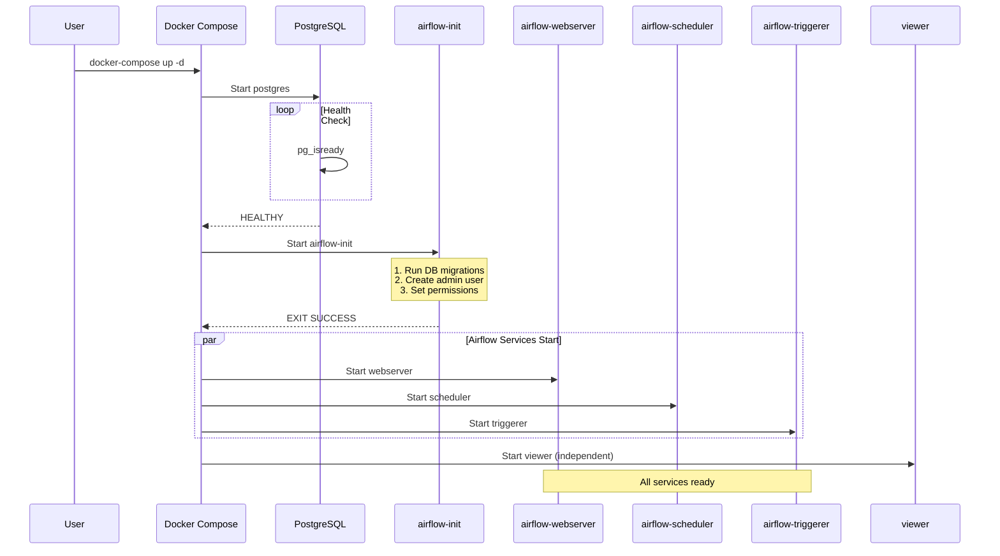
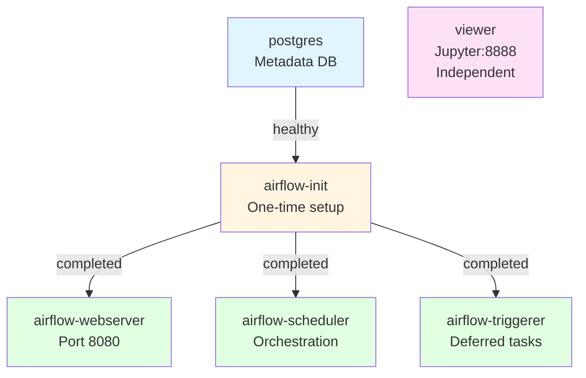
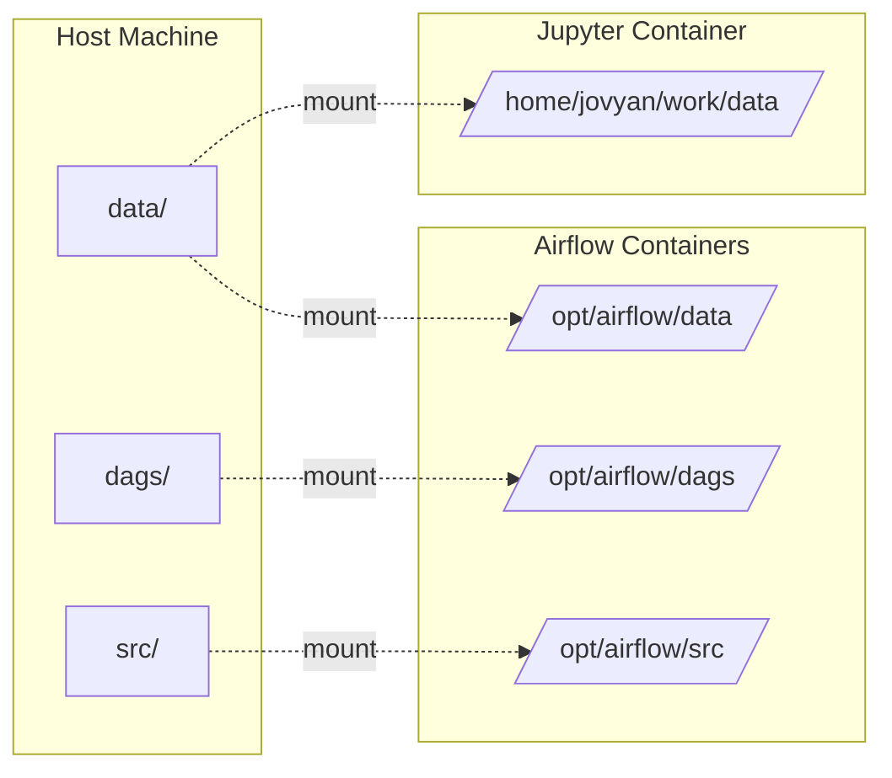
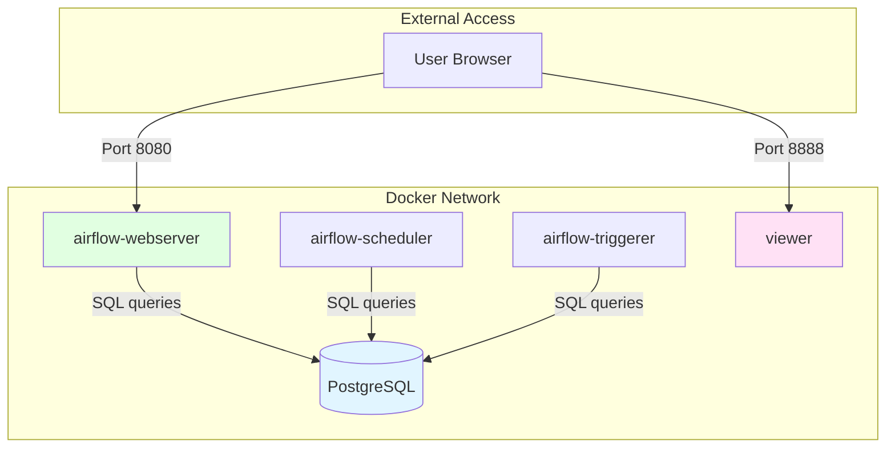

# Docker Services Guide

**Purpose**: Overview of container architecture and service dependencies
**Status**: Production deployment with 6 containerized services

---

## Service Overview

| Service | Purpose | Ports | Dependencies |
|---------|---------|-------|--------------|
| **postgres** | Airflow metadata storage | 5432 (internal) | None |
| **airflow-init** | One-time setup | N/A (exits) | postgres (healthy) |
| **airflow-webserver** | Web UI & API | 8080 | postgres + init |
| **airflow-scheduler** | Task orchestration | N/A | postgres + init |
| **airflow-triggerer** | Deferred tasks | N/A | postgres + init |
| **viewer** | Jupyter analytics | 8888 | None (independent) |

---

## Service Startup Sequence



**Total Startup Time**: 2-5 minutes (first run with build)

---

## Service Dependencies



---

## Key Services Explained

### PostgreSQL (Metadata Storage)

**Purpose**: Store Airflow metadata (not analytics data)

**What It Stores**:
- DAG definitions and schedules
- Task execution history and states
- XCom data (inter-task communication)
- User accounts and permissions

**Health Check**:
```bash
pg_isready -U airflow  # Checks every 10 seconds
```

**Why Critical**: All Airflow services wait for this health check before starting.

---

### airflow-init (One-Time Setup)

**Purpose**: Initialize Airflow environment, then exit

**Tasks Performed**:
1. Validate Airflow version (≥2.2.0)
2. Check system resources (CPU, RAM, disk)
3. Run database migrations (create metadata tables)
4. Create admin user (username/password from .env)
5. Create data directories (`raw/`, `staged/`, etc.)
6. Set file permissions (UID 50000, GID 100)

**Runs As**: Root (required for `chown`/`chmod`)

**After Completion**: Container exits, other services start

---

### airflow-webserver (UI & API)

**Purpose**: Provide web interface for Airflow

**Access**: http://localhost:8080 (admin/admin)

**Features**:
- DAG management and monitoring
- Task logs and execution history
- Gantt charts and visualizations
- REST API endpoints

**Health Check**:
```bash
curl --fail http://localhost:8080/health
```

---

### airflow-scheduler (Orchestration Engine)

**Purpose**: The "brain" of Airflow

**Responsibilities**:
- Parse DAG files every 30 seconds
- Schedule tasks based on dependencies
- Monitor task execution
- Handle retries and failures

**Critical**: If scheduler stops, no tasks will be scheduled

**Health Check**:
```bash
airflow jobs check --job-type SchedulerJob
```

---

### airflow-triggerer (Deferred Tasks)

**Purpose**: Handle long-running waits efficiently

**Example Use Case** (Master Pipeline):
```python
TriggerDagRunOperator(
    task_id="trigger_fetch_air_quality",
    wait_for_completion=True,  # Defers to triggerer
    poke_interval=30,          # Check every 30s
)
```

**Benefit**: Releases task slot while waiting, improves parallelism

---

### viewer (Jupyter Analytics)

**Purpose**: Interactive data analysis with Jupyter

**Access**: http://localhost:8888 (no token)

**Features**:
- Direct DuckDB access
- Pre-built EDA notebooks
- Data visualization (matplotlib, seaborn)

**Independence**: No dependencies, can start/stop independently

---

## Volume Mounting Strategy



**Permissions**: UID 50000 (airflow), GID 100 (users), Mode 775

**Why**: Allows both Airflow and Jupyter to access data files

---

## Network Communication



**Port Mapping**:
- `8080:8080` → Airflow UI
- `8888:8888` → Jupyter
- PostgreSQL not exposed (internal only)

---

## Common Operations

### Start Services

```bash
# Using docker-compose
cd docker/airflow
docker-compose up -d

# Using Makefile
make airflow-up
```

### Stop Services

```bash
docker-compose down  # Preserves data

# Or
make airflow-down
```

### View Logs

```bash
# All services
docker-compose logs -f

# Specific service
docker-compose logs -f airflow-scheduler

# Last 100 lines
docker-compose logs --tail=100 airflow-webserver
```

### Restart Single Service

```bash
docker-compose restart airflow-scheduler
```

---

## Health Check Status

```bash
# Check all services
docker-compose ps

# Detailed health status
docker inspect --format='{{.State.Health.Status}}' <container-name>
```

**Health Status Values**:
- `starting` - Health check not yet run
- `healthy` - Most recent check passed
- `unhealthy` - Health check failing

---

## Troubleshooting

### Issue: Permission Errors

**Symptom**: `airflow-init` fails with permission denied

**Solution**:
```bash
# Fix data directory permissions
sudo chown -R 50000:100 data/
chmod -R 775 data/

# Or use Makefile
make fix-permissions
```

---

### Issue: Webserver Not Accessible

**Symptom**: http://localhost:8080 not loading

**Diagnosis**:
```bash
# Check container status
docker-compose ps airflow-webserver

# Check logs
docker-compose logs airflow-webserver

# Check health
docker inspect --format='{{.State.Health.Status}}' <container-id>
```

**Common Causes**:
- Container still starting (wait 30-60s)
- Port conflict (another service using 8080)
- Health check failing (check logs)

---

### Issue: DAGs Not Appearing

**Symptom**: DAGs don't show in UI

**Diagnosis**:
```bash
# Check scheduler logs
docker-compose logs -f airflow-scheduler | grep "Processing file"

# Check DAG directory
docker-compose exec airflow-scheduler ls -la /opt/airflow/dags
```

**Solutions**:
- Check for Python syntax errors in DAG files
- Verify volume mount is correct
- Restart scheduler: `docker-compose restart airflow-scheduler`

---

## Best Practices

### Development

✅ Use named volumes for persistence
✅ Mount source directories for live editing
✅ Enable DAG auto-reload (scan every 30s)

### Production

✅ Set strong passwords in `.env`
✅ Enable health checks
✅ Set resource limits
✅ Don't expose PostgreSQL port
✅ Run as non-root user (except init)

---

## Related Documentation

- [docker-compose.yml](../docker/airflow/docker-compose.yml) - Full configuration with inline comments
- [ARCHITECTURE.md](./ARCHITECTURE.md) - System architecture
- [PIPELINE_VISUAL_GUIDE.md](./PIPELINE_VISUAL_GUIDE.md) - Pipeline flow
- [PROJECT_STARTUP.md](./PROJECT_STARTUP.md) - Getting started

---

**Document Status**: ✅ Complete
**Last Updated**: 2025-10-14
**Purpose**: Tutor feedback response (service dependencies explanation)
