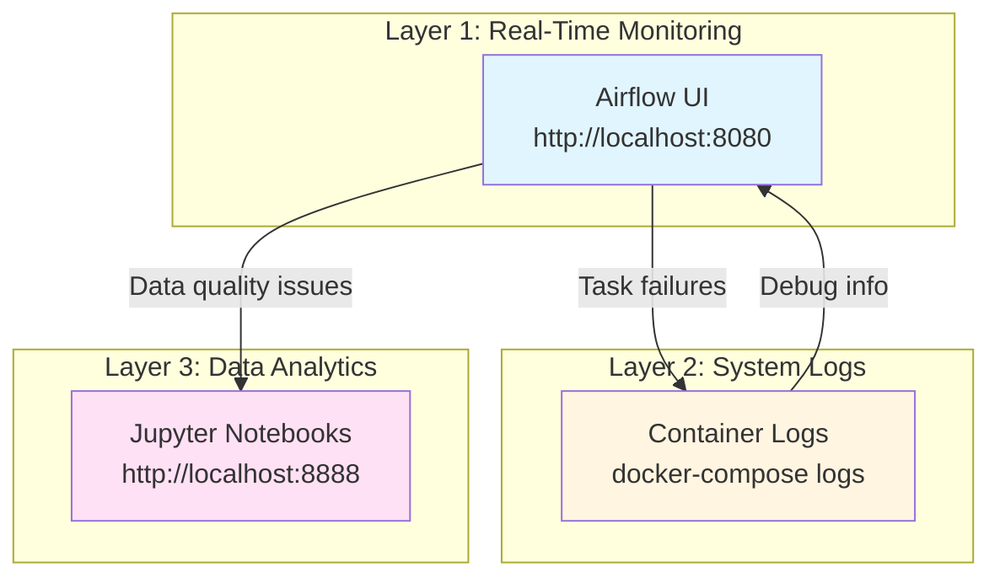
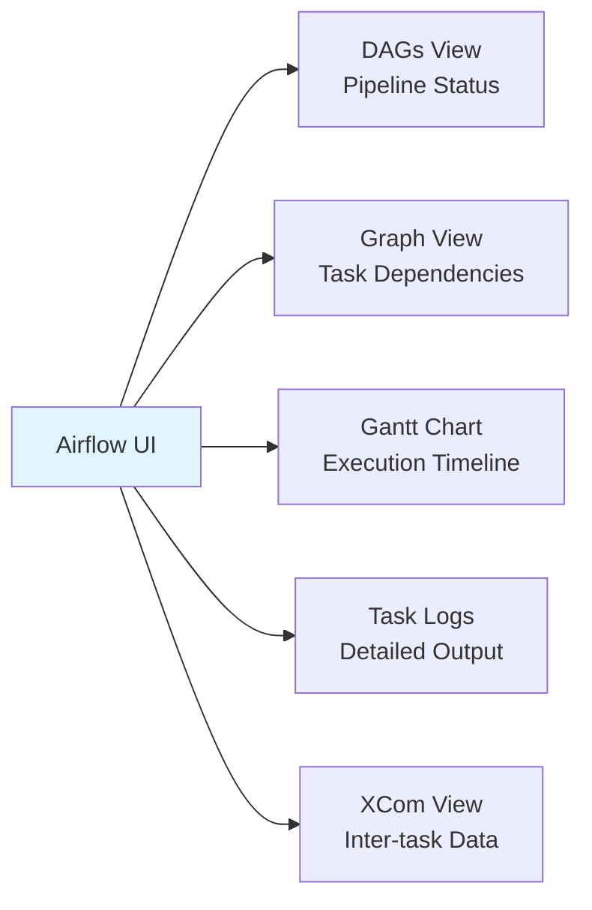
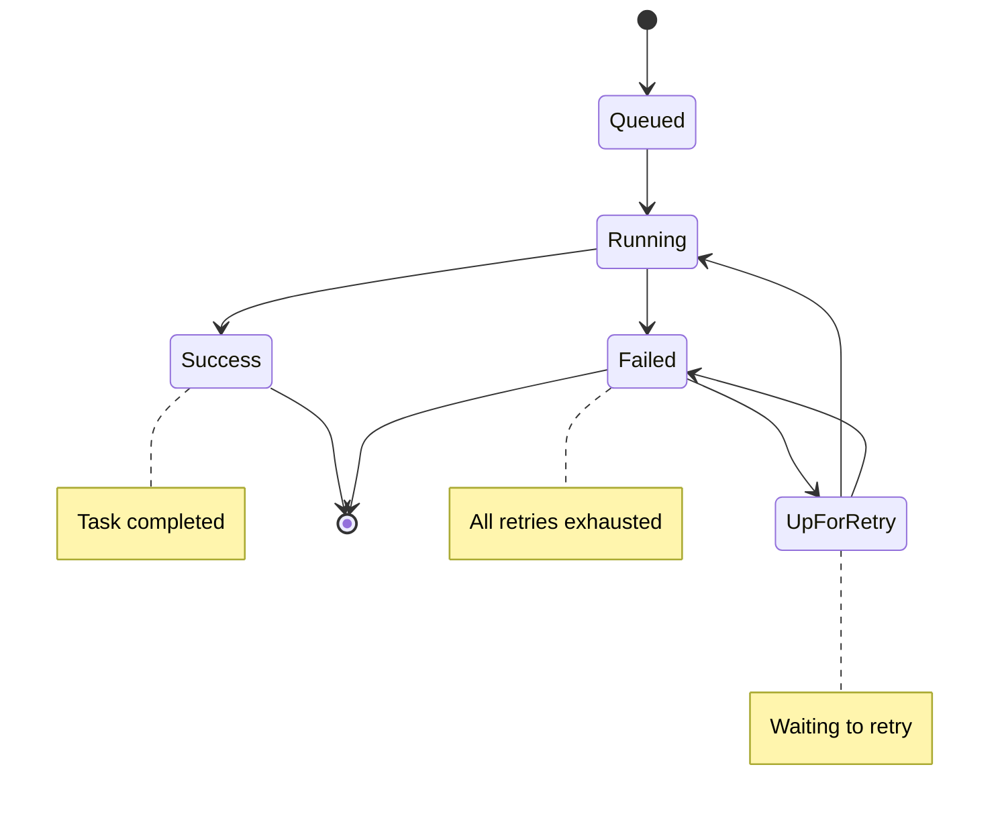
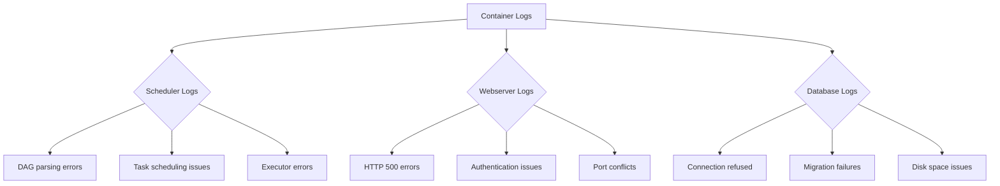
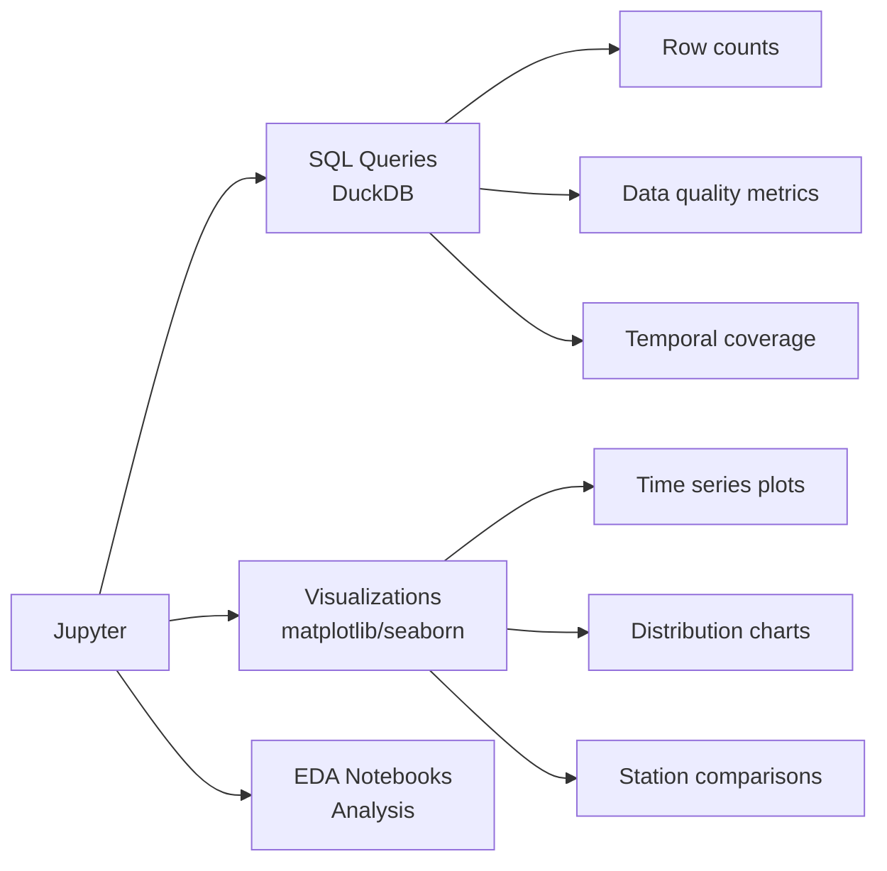
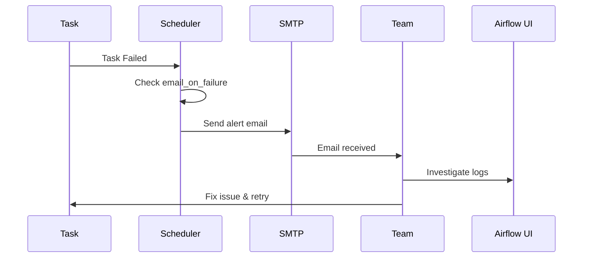

# Monitoring & Observability Guide

**Purpose**: Documentation of pipeline monitoring, alerting, and observability features
**Status**: Production monitoring with multi-layer visibility

---

## Overview

The pipeline provides **3-layer observability**: Airflow UI for real-time monitoring, container logs for system-level debugging, and Jupyter for data analytics. This enables monitoring from pipeline orchestration down to individual data quality metrics.



---

## Layer 1: Airflow UI Monitoring

### Accessing the Dashboard

**URL**: http://localhost:8080
**Credentials**: admin/admin (default)

### Key Monitoring Features



---

### DAGs View (Main Dashboard)

**What You See**:
- All available DAGs with their status
- Last run time and next scheduled run
- Success/failure indicators
- Active/paused state

**Monitoring Actions**:
```bash
# Pipeline status at a glance
✅ Green circle = Last run successful
❌ Red circle = Last run failed
🔵 Blue circle = Currently running
⏸️ Gray = Paused
```

**Quick Actions**:
- Trigger DAG manually (play button)
- Pause/unpause scheduling (toggle)
- View recent runs (calendar icon)
- Delete DAG runs (trash icon)

---

### Task Logs (Primary Debugging Tool)

**Access**: DAGs → Select DAG → Graph View → Click Task → Logs tab

**What Logs Contain**:
1. **Task initialization** - Environment setup
2. **Application output** - Your Python print statements
3. **Data processing stats** - Row counts, file sizes
4. **Error stack traces** - When failures occur
5. **Retry attempts** - Shows attempt number

**Example Log Output**:
```
[2025-10-14 10:30:15] INFO - Task attempt: 1
[2025-10-14 10:30:16] INFO - Downloading: air_quality_2021.xlsx
[2025-10-14 10:30:45] INFO - File size: 12.5 MB
[2025-10-14 10:30:46] INFO - Download complete
```

---

### Task States



**Color Coding**:
- 🟢 **Success** - Dark green border
- 🔴 **Failed** - Red border
- 🟡 **Up for Retry** - Yellow/orange border
- 🔵 **Running** - Light green border
- ⚪ **Queued** - Light gray border

---

### Gantt Chart (Execution Timeline)

**Access**: DAGs → Select DAG → Gantt tab

**What It Shows**:
- Task execution timeline
- Task duration (bar length)
- Parallel task execution
- Bottlenecks in pipeline

**Example Interpretation**:

```mermaid
gantt
    title Master Pipeline Execution (Example)
    dateFormat X
    axisFormat %M:%S

    section Ingestion
    Fetch Air Quality :0, 8
    Fetch Wind :0, 8

    section Staging
    Stage Air Quality :8, 11
    Stage Wind :8, 11

    section Normalization
    Normalize All :11, 13

    section Loading
    Load to DuckDB :13, 20
```


**Key Insight**: Tasks at the same time = parallel execution

---

## Layer 2: Container Logs

### Viewing Container Logs

**Access all services**:
```bash
docker-compose logs -f
```

**Access specific service**:
```bash
# Scheduler logs (task orchestration)
docker-compose logs -f airflow-scheduler

# Webserver logs (UI issues)
docker-compose logs -f airflow-webserver

# Database logs
docker-compose logs -f postgres
```

**View last N lines**:
```bash
docker-compose logs --tail=100 airflow-scheduler
```

---

### What to Look For



**Common Log Patterns**:
- `ERROR` - Something went wrong
- `WARNING` - Potential issue, not critical
- `INFO` - Normal operation
- `DEBUG` - Detailed execution info

---

## Layer 3: Jupyter Analytics

### Accessing Jupyter

**URL**: http://localhost:8888
**Token**: None required (disabled for convenience)

### Monitoring Capabilities



---

### Example Monitoring Queries

**Check pipeline health**:
```python
import duckdb

conn = duckdb.connect('/home/jovyan/work/data/duckdb/cct_sensors.duckdb')

# Total measurements by source
conn.execute("""
    SELECT source, COUNT(*) as count
    FROM fact_measurement
    GROUP BY source
""").df()

# Data quality summary
conn.execute("""
    SELECT
        quality_flag,
        COUNT(*) as count,
        ROUND(COUNT(*) * 100.0 / SUM(COUNT(*)) OVER (), 2) as percentage
    FROM fact_measurement
    GROUP BY quality_flag
""").df()

# Recent data availability
conn.execute("""
    SELECT
        DATE_TRUNC('day', timestamp) as date,
        COUNT(*) as measurements
    FROM fact_measurement
    WHERE timestamp >= CURRENT_DATE - INTERVAL '7 days'
    GROUP BY date
    ORDER BY date DESC
""").df()
```

---

## Email Alerts (Optional Configuration)

### Setting Up Email Notifications

**Step 1: Configure SMTP in `.env`**

Edit `docker/airflow/.env`:
```bash
# Email Configuration
AIRFLOW__SMTP__SMTP_HOST=smtp.gmail.com
AIRFLOW__SMTP__SMTP_PORT=587
AIRFLOW__SMTP__SMTP_USER=your-email@gmail.com
AIRFLOW__SMTP__SMTP_PASSWORD=your-app-password
AIRFLOW__SMTP__SMTP_MAIL_FROM=your-email@gmail.com
```

**Step 2: Enable in DAG default_args**

```python
default_args = {
    "email": ["data-team@example.com"],
    "email_on_failure": True,
    "email_on_retry": False,
    "retries": 1,
    "retry_delay": timedelta(minutes=5),
}
```

**Step 3: Restart services**
```bash
docker-compose restart airflow-webserver airflow-scheduler
```

---

### Alert Flow



**Email Content Includes**:
- DAG name and task ID
- Execution date and time
- Error message and stack trace
- Link to Airflow UI task logs

---

## Monitoring Checklist

### Daily Monitoring

**Airflow UI** (2 minutes):
- [ ] Check DAGs view - any red circles?
- [ ] Review recent task failures
- [ ] Verify last successful run times

**Quick Health Check**:
```bash
# All services running?
docker-compose ps

# Any error logs in last hour?
docker-compose logs --since 1h | grep ERROR
```

---

### Weekly Review

**Data Quality Check** (5 minutes via Jupyter):
```python
# 1. Verify data freshness
conn.execute("""
    SELECT MAX(timestamp) as latest_data
    FROM fact_measurement
""").df()

# 2. Check for anomalies
conn.execute("""
    SELECT
        DATE_TRUNC('day', timestamp) as date,
        COUNT(*) as measurements
    FROM fact_measurement
    WHERE timestamp >= CURRENT_DATE - INTERVAL '30 days'
    GROUP BY date
    ORDER BY date DESC
""").df()

# 3. Station coverage
conn.execute("""
    SELECT
        s.station_name,
        COUNT(f.measurement_pk) as measurements,
        MAX(f.timestamp) as latest
    FROM dim_station s
    LEFT JOIN fact_measurement f ON s.station_pk = f.station_fk
    GROUP BY s.station_name
    ORDER BY measurements DESC
""").df()
```

---

## Troubleshooting with Monitoring Tools

### Issue: Pipeline Running Slowly

**Diagnosis Steps**:
1. **Airflow UI → Gantt Chart**: Identify slow tasks
2. **Task Logs**: Look for network timeouts or retries
3. **Container Logs**: Check for resource constraints

**Common Causes**:
- Network latency (external API downloads)
- Large file processing (normal for multi-GB files)
- Database locks (concurrent writes)

---

### Issue: Tasks Failing Intermittently

**Diagnosis Steps**:
1. **Airflow UI → Task Logs**: Check retry attempts
2. **Look for patterns**: Same error each time?
3. **Check quarantine files**: `data/quarantine/`

**Common Causes**:
- Transient network errors (retries should handle)
- External API rate limits
- Disk space issues

**Resolution**:
```bash
# Check disk space
df -h

# Check quarantine files
ls -lh data/quarantine/

# Restart scheduler if needed
docker-compose restart airflow-scheduler
```

---

## Monitoring Best Practices

### For Development

✅ Keep Airflow UI open during DAG development
✅ Use `print()` statements liberally (appears in task logs)
✅ Test DAGs with `catchup=False` to avoid backfills
✅ Monitor task duration to optimize parallelism

### For Production

✅ Set up email alerts for critical DAGs
✅ Review logs weekly for warnings
✅ Monitor disk space (DuckDB database grows)
✅ Archive old DAG runs periodically

---

## Quick Reference

### Access Points

| Component | URL | Purpose |
|-----------|-----|---------|
| Airflow UI | http://localhost:8080 | Pipeline monitoring |
| Jupyter | http://localhost:8888 | Data analytics |
| Container Logs | `docker-compose logs` | System debugging |

### Key Commands

```bash
# Check service health
docker-compose ps

# View logs
docker-compose logs -f [service-name]

# Restart service
docker-compose restart [service-name]

# Check Airflow health
docker-compose exec airflow-webserver airflow version
```

---

## Related Documentation

- [FAULT_TOLERANCE_LOGGING.md](./FAULT_TOLERANCE_LOGGING.md) - Error handling and retry mechanisms
- [DOCKER_SERVICES_GUIDE.md](./DOCKER_SERVICES_GUIDE.md) - Container architecture
- [PIPELINE_VISUAL_GUIDE.md](./PIPELINE_VISUAL_GUIDE.md) - Pipeline flow and execution

---

**Document Status**: ✅ Complete
**Last Updated**: 2025-10-14
**Purpose**: Tutor feedback response (monitoring and alerting documentation)
