# Pipeline Visual Guide

**Purpose**: Visual documentation of the CCT Environmental Sensors data pipeline
**Status**: Complete pipeline with 2.9M+ measurements
**Total Duration**: 10-15 minutes end-to-end

---

## Overview

```mermaid
graph TB
    subgraph "Phase 1: Data Ingestion (5-10m)"
        A1[Fetch Air Quality<br/>7 datasets, 2016-2022]
        A2[Fetch Wind Data<br/>5 datasets, 2016-2020]
    end

    subgraph "Phase 2: Staging (3-5m)"
        B1[Stage Air Quality<br/>ZIP/Excel → Parquet]
        B2[Stage Wind<br/>Excel → Parquet]
    end

    subgraph "Phase 3: Normalization (2-3m)"
        C1[Normalize Air Quality<br/>Wide → Tall schema]
        C2[Normalize Wind<br/>Wide → Tall schema]
        C3[Station Dimension<br/>11 stations]
    end

    subgraph "Phase 4: Loading & DQ (8-12m)"
        D1[Initialize DuckDB Schema]
        D2[Load 2.9M Measurements]
        D3[Data Quality Checks]
        D4[Validation & Summary]
    end

    A1 --> B1
    A2 --> B2
    B1 --> C1
    B2 --> C2
    C1 --> C3
    C2 --> C3
    C3 --> D1
    D1 --> D2
    D2 --> D3
    D3 --> D4
```

**Key Metrics**:
- **Total Pipeline Duration**: 10-15 minutes
- **Data Volume**: 2.9M+ measurements
- **Stations**: 11 monitoring locations
- **Temporal Coverage**: 2016-2022 (7 years)
- **Data Quality**: 58.6% valid measurements

---

## Complete Pipeline Flow

### Phase 1: Data Ingestion (Parallel)

**Features**:
- Parallel downloads (up to 12 simultaneous)
- 3 retry attempts with exponential backoff
- Automatic quarantine of failed downloads
- Content validation and size checks

---

### Phase 2: Staging (Parallel)

**Output**: 24 staged Parquet files (19 air quality + 5 wind)

---

### Phase 3: Normalization (Parallel)

**Schema** (Tall Format):
- `datetime` - Timestamp
- `station_pk` - Station surrogate key
- `metric` - Measurement type (wind_speed, pm10, no2, etc.)
- `value` - Measurement value
- `unit` - Unit of measurement
- `quality_flag` - VALID or NODATA
- `source` - wind or air_quality

---

### Phase 4: Loading & Data Quality (Sequential)

**Data Quality Results**:
- ✅ **Referential Integrity**: 100% (0 orphaned records)
- ✅ **Primary Keys**: 100% (0 duplicates)
- ✅ **Temporal Integrity**: 100% (0 null timestamps)
- 📊 **Data Completeness**: 58.6% valid measurements

---

## Parallel vs Sequential Execution

**Parallelism Benefits**:
- **Phase 1-3**: Tasks run in parallel within each phase
- **Phase 4**: Sequential to ensure data consistency
- **Total Duration**: ~13 minutes (vs 50+ minutes if fully sequential)

---

## Error Handling Flow

**Error Handling Layers**:
1. **Airflow Task Retries**: 1-2 retries per task (5 min delay)
2. **Application Retries**: 3 attempts with 4-10s exponential backoff
3. **Quarantine System**: Failed items isolated with error details
4. **XCom Tracking**: Inter-task state visible in Airflow UI
5. **Idempotent Operations**: Safe to re-run entire pipeline

---

## Data Transformation Journey

---

## Star Schema Design

**Database Statistics**:
- **dim_station**: 11 rows
- **fact_measurement**: 2,963,373 rows
- **Database size**: 414.5 MB
- **Query performance**: <500ms for analytical queries

---

## Monitoring Points

**Access Points**:
- **Airflow UI**: http://localhost:8080 (admin/admin)
- **Jupyter**: http://localhost:8888 (no token)
- **Container Logs**: `docker-compose logs -f [service]`
- **DuckDB**: Direct SQL access via Jupyter or DBeaver

---

## Key Takeaways

### Design Principles

✅ **Maximize Parallelism**: Independent tasks run concurrently (Phases 1-3)
✅ **Ensure Data Consistency**: Sequential execution for database operations (Phase 4)
✅ **Comprehensive Error Handling**: Multi-layer retry with quarantine system
✅ **Idempotent Operations**: Safe to re-run entire pipeline
✅ **Observable**: Multi-layer monitoring (Airflow UI, logs, DQ metrics)
✅ **Analytics-Optimized**: Star schema with columnar storage and indexes

---

**Document Status**: ✅ Complete
**Last Updated**: 2025-10-14
**Purpose**: Tutor feedback response (visual diagram requirement)
